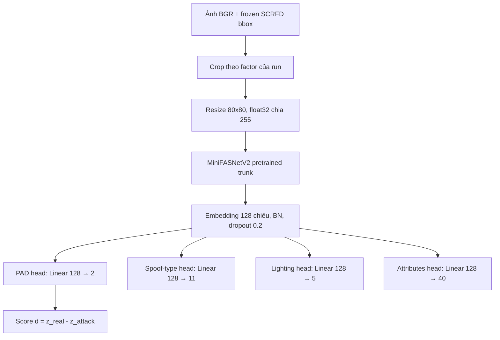

# Tổng hợp kiến trúc và các variant C / P3 / R7

> Tổng hợp từ implementation và config notebook hiện tại, ngày 03/10/2026. Tài liệu mô tả thiết kế, không tổng hợp kết quả thực nghiệm hay tuyên bố variant thắng.

## 1. Kiến trúc chung

C, P3 và R7 dùng **cùng một kiến trúc inference**. Các tên này biểu thị cơ chế huấn luyện và cách giám sát spectral view.



### Backbone và heads

| Thành phần | Thiết kế |
|---|---|
| Backbone | MiniFASNetV2, `embedding_size=128`, `conv6_kernel=(5,5)` |
| Representation | Chuỗi conv/depthwise blocks → flatten → linear → BN → dropout |
| PAD | 2 logits: Real / Attack |
| Spoof type | 11 logits, Cross Entropy |
| Lighting | 5 logits, Cross Entropy |
| Attributes | 40 logits, BCEWithLogits; chỉ giám sát mẫu Real |
| Input | BGR, `3×80×80`, float32 `[0,1]`, không normalization |
| Score | `d = z_real − z_attack`; càng lớn càng nghiêng về Real |
| Quyết định | Real nếu `d >= threshold` |

Khởi tạo dùng official PAD-pretrained MiniFASNetV2: tải các trọng số trunk tương thích, bỏ classifier lịch sử `prob.weight`, thay classifier bằng các project heads được khởi tạo theo seed 100. Trong từng vòng đối chứng, các run dùng cùng initialization policy và trạng thái khởi tạo xác định.

Spectral views được tạo **trong huấn luyện**, cùng đi qua model chia sẻ trọng số. Khi inference, mỗi ảnh crop đi qua một forward PAD thông thường; không cần FFT, chọn band hay harmful gate.

### Auxiliary loss chung

```text
L_aux = 0.1 × CE_spoof_type
      + 0.1 × CE_lighting
      + 1.0 × BCE_attributes_real_only
```

Auxiliary supervision chỉ dùng **clean view**. Không có Real trong batch thì attribute loss là differentiable zero.

## 2. Preprocessing và spectral generator

### Crop và augmentation

Evaluation dùng frozen raw SCRFD bbox, không jitter/augmentation. Training dùng bbox jitter trước khi crop:

- Xác suất `0.20`.
- Scale bbox `0.95–1.05`.
- Dịch tâm `±0.05 × face size`.
- Sau đó crop theo factor của run, resize 80×80 và áp dụng augmentation.

Augmentation giữ nguyên: HorizontalFlip `p=.5`, ISONoise `p=.2`, RandomBrightnessContrast limits `.2` với `p=.3`, MotionBlur limit `5` với `p=.2`.

Crop dùng helper CropImage-compatible hiện tại. Ở biên ảnh, helper có giới hạn scale để vừa ảnh và dịch cửa sổ vào trong; không thay bằng padding hay geometry khác. Vì vậy context thực tế phụ thuộc bbox và kích thước ảnh, không luôn tăng đúng theo factor cấu hình.

### Ba spectral views

Từ cùng clean tensor `x`, tạo LOW/MID/HIGH bằng Gaussian masks trên bán kính FFT chuẩn hóa:

```text
G_k(r) = exp(−(r − center_k)² / (2 × sigma²))
field_k = 1 − (1 − gain) × G_k
view_k = clamp(real(iFFT(FFT(x) × field_k)), 0, 1)
```

Geometry gốc:

```text
centers = [0.15, 0.45, 0.75]
sigma   = 0.10
gain    ~ Uniform(0.65, 0.90)
```

Một gain được lấy cho mỗi mẫu, dùng chung giữa ba band và giữa các channel. Chỉ attenuation, không amplification; DC được giữ. Phase được giữ trong phép điều chế FFT, trước bước iFFT/clamp. Không alignment hoặc TTA.

## 3. Ba cơ chế chính

### C — clean baseline

```text
L_C = CE_clean + L_aux
```

C chỉ forward clean view, không tạo spectral views. Checkpoint có thể được chọn từ epoch 1.

### P3 — adaptive worst-band CE

PAD margin theo nhãn:

```text
d = z_real − z_attack
m = d  nếu Real
m = −d nếu Attack
```

Chọn band theo từng mẫu:

```text
k* = argmin(m_LOW, m_MID, m_HIGH)
```

Selection chạy `eval()` + `no_grad()`, không cập nhật BatchNorm; sau đó khôi phục train mode và forward selected-worst view với gradient.

```text
L_P3 = 0.75 × CE_clean + 0.25 × CE_worst + L_aux
```

Tất cả mẫu đều tham gia selected-worst CE. Không harmful gate, KL hay margin regression. Helper micro hiện tại còn tính clean margin trong selection pass để phục vụ diagnostics.

### R7 — binary harmful-gated worst CE

Chọn worst band như P3, đồng thời lấy clean và worst margins từ selection pass BN-safe:

```text
harmful_i = (m_worst_i < m_clean_i).detach()

CE_harmful = sum(harmful_i × CE_worst_i) / harmful_count
             nếu harmful_count > 0
             hoặc differentiable zero nếu không có mẫu harmful

L_R7 = 0.75 × CE_clean + 0.25 × CE_harmful + L_aux
```

Harmful là **margin bị giảm so với clean**, không nhất thiết là dự đoán sai. R7 vẫn forward toàn bộ selected batch; mask chỉ quyết định mẫu nào đóng góp spectral loss. Các mẫu harmful được cân bằng trọng số với nhau.

Nếu không có mẫu harmful, spectral term bằng zero nhưng clean coefficient vẫn là `0.75`; không tự đổi thành loss C.

### So sánh trực tiếp

| Cơ chế | Tạo spectral | Chọn worst | Mẫu tham gia spectral loss | Trọng số trong spectral loss |
|---|---|---|---|---|
| C | Không | Không | Không | Không |
| P3 | LOW/MID/HIGH | Có | Tất cả | Đồng đều |
| R7 | LOW/MID/HIGH | Có | Margin giảm so với clean | Đồng đều giữa harmful samples |
| R7_SEV | LOW/MID/HIGH | Có | Positive margin degradation | Theo severity, có normalization |

## 4. Các vòng thiết kế và run IDs

### 4.1 C/P3/R7 gốc tại crop 2.7

| Quy mô | C | P3 | R7 | Notebook |
|---|---|---|---|---|
| Train10K / Val3K | `R0_clean` | `R1_p3_ce25` | `R7_harmful_gated_worst` | [06](06_micro_R0_R4.ipynb), [07](07_micro_R6_R9.ipynb) |
| Train100K / Val15K | `C100k_copy_pretrained` | `P3_100k_worst_ce25` | `R7_100k_harmful_gated_worst` | [04](04_scale100k_C_P3_Q3.ipynb), [09](09_scale100k_R6_R7.ipynb) |

Notebook 06 còn có các ablation trọng số worst CE: `R2_worst_ce15` (0.15), `R3_worst_ce35` (0.35), `R4_worst_ce50` (0.50); clean coefficient tương ứng `1 − spectral coefficient`. P3 chuẩn trong các thiết kế hiện tại dùng `0.25`.

### 4.2 Inference-only crop sensitivity — notebook 11

[11_crop_sensitivity_100k.ipynb](11_crop_sensitivity_100k.ipynb) hỗ trợ frozen C/P3/R7 100K, mặc định P3, với crop `[1.0, 1.5, 2.0, 2.7]`.

Không huấn luyện lại. Mỗi model/crop hiệu chỉnh threshold riêng trên frozen Val15K rồi đánh giá LCC. Checkpoint được huấn luyện tại 2.7 nên vòng này đo sensitivity của preprocessing lúc inference; không trả lời trực tiếp hiệu quả của việc training với crop mới.

### 4.3 Matched train/eval crop — notebook 12

[12_micro_crop_train_C_P3_R7.ipynb](12_micro_crop_train_C_P3_R7.ipynb): sáu run, giữ nguyên cơ chế và geometry spectral gốc.

| Family | Crop 1.5 | Crop 2.0 | Loss |
|---|---|---|---|
| C | `C_crop15` | `C_crop20` | Clean CE + aux |
| P3 | `P3_crop15` | `P3_crop20` | 0.75 clean + 0.25 worst + aux |
| R7 | `R7_crop15` | `R7_crop20` | 0.75 clean + 0.25 harmful + aux |

Trong từng run: **Train crop s → Val crop s → threshold từ Val crop s → LCC crop s**. Control micro 2.7 được đọc từ kết quả lịch sử, không retrain.

`MODEL_FILTER="C"/"P3"/"R7"` tách ba phiên Kaggle. `CROP_FILTER=[1.5]` hoặc `[2.0]` tách từng crop.

### 4.4 Scale-aware geometry tại crop 1.5 — notebooks 13/14

Cố định Train/Val/LCC crop 1.5. Giả thuyết: face chiếm tỷ lệ khác trong ảnh 80×80 sau đổi crop, nên vị trí/bề rộng Gaussian spectral bands có thể cần điều chỉnh.

```text
ratio          = 1.5 / 2.7 = 0.5555555556
scaled_centers = original_centers × ratio
               = [0.0833333333, 0.25, 0.4166666667]
scaled_sigma   = 0.10 × ratio = 0.0555555556
```

| Run | Notebook | Centers | Sigma | Spectral supervision | Biến đang kiểm tra |
|---|---|---|---|---|---|
| `P3_SC_crop15` | [13](13_micro_P3_scaleaware_crop15.ipynb) | Scaled | 0.10 | P3 worst CE | Centers |
| `P3_SF_crop15` | [13](13_micro_P3_scaleaware_crop15.ipynb) | Scaled | 0.0555555556 | P3 worst CE | Centers + bandwidth |
| `R7_SC_crop15` | [14](14_micro_R7_scaleaware_severity_crop15.ipynb) | Scaled | 0.10 | Binary harmful CE | Centers |
| `R7_SF_crop15` | [14](14_micro_R7_scaleaware_severity_crop15.ipynb) | Scaled | 0.0555555556 | Binary harmful CE | Centers + bandwidth |
| `R7_SEV_crop15` | [14](14_micro_R7_scaleaware_severity_crop15.ipynb) | **Gốc** | **0.10** | Severity-weighted CE | Harmful weighting |

- SC so với historical fixed crop15: kiểm tra center scaling.
- SF so với SC: kiểm tra tác động bổ sung của sigma scaling.
- Scaling dùng tỷ lệ crop cấu hình; xử lý biên ảnh khiến đây là xấp xỉ, chưa phải normalization chính xác theo face scale của mỗi ảnh.
- Không retrain `C_crop15`, `P3_crop15`, `R7_crop15` trong vòng 13/14.

### 4.5 R7_SEV — severity-aware harmful weighting

Binary R7 cho các mẫu harmful trọng số ngang nhau, dù margin giảm ít hay nhiều. SEV thay cách weighting bằng raw positive degradation:

```text
delta_i = max(0, m_clean_i − m_worst_i)
w_i     = delta_i.detach()
eps     = 1e-8

CE_severity = sum(w_i × CE_worst_i) / (sum(w_i) + eps)
              nếu sum(w_i) > eps
              hoặc differentiable zero nếu không đủ weight

L_R7_SEV = 0.75 × CE_clean + 0.25 × CE_severity + L_aux
```

Margins, delta và weights không truyền gradient. Không dùng `mean(w×CE)` thiếu normalization; không square, exponent, temperature hay severity clipping ngoài phép lấy phần dương đã định nghĩa.

**SEV giữ geometry gốc** để phép so sánh `R7_crop15 → R7_SEV_crop15` chỉ thay harmful weighting. Hiện không có SC+SEV hoặc SF+SEV.

## 5. Protocol micro dùng chung

| Thành phần | Cấu hình |
|---|---|
| Data | Frozen Train10K / Val3K; không resample |
| Seeds | Data split 43; training 100 |
| Optimizer | SGD, lr=.005, momentum=.9, weight decay=5e-4 |
| Batch / AMP | Batch 256; AMP bật theo config |
| Epoch budget | Tối đa 20 epochs |
| Scheduler | MultiStepLR `[6,14]`, gamma=.2; step sau mỗi epoch |
| LR | Epoch 1–6: .005; 7–14: .001; 15–20: .0002 |
| Early stopping | Sớm nhất epoch 8; patience 4 |
| Best checkpoint | Val3K ACER thấp nhất; tie-break AUC cao nhất |
| Warm-up P3/R7 | Epoch 1: clean CE + aux; không tham gia spectral best/patience |
| C | Clean xuyên suốt; eligible từ epoch 1 |
| Epoch evaluation | Chỉ Val3K |

Không đưa phase-aware stopping mới vào các vòng micro crop/geometry/severity.

### Evaluation sau training

```text
Reload best checkpoint
→ Infer source Val cùng crop
→ Tính source min-ACER threshold và freeze
→ LCC train / dev / official eval cùng crop
→ Ghép predictions → tính lại LCC combined
```

| LCC population | Raw candidates |
|---|---:|
| Training | 8,299 |
| Development | 2,948 |
| Official evaluation | 7,580 |
| Combined | 18,827 |

Combined không phải trung bình metrics của ba split. Mẫu localization fail giữ ở candidate table nhưng không có score; báo cáo scored count và coverage.

Primary endpoint các vòng micro mới: **LCC Combined AUC**. Theo dõi thêm official-evaluation AUC, pooled EER/HTER/TPR@FPR1%, và Val ACER/AUC làm source guard. Không fit threshold hoặc chọn checkpoint bằng LCC.

Các notebook micro 06/07 mặc định bỏ CelebA full Test; 12/13/14 không có Test inference. Notebook 11 cũng bỏ full Test. Vòng scale100K 04/09 có full Test sau source threshold freeze.

## 6. Diagnostics và cách đọc kết quả

| Nhóm | Diagnostics chính |
|---|---|
| P3 | Clean/worst CE, total loss, worst-band fractions, margins/drop, flips, sampled gain |
| R7 binary | Các mục trên + harmful count/fraction/CE |
| R7_SEV | Mean/median/max positive delta, weight sum, positive fraction, effective weighted count, unweighted harmful CE, weighted CE |
| Crop | Boundary-limited fraction; mean/median crop width/image width và height/image height |

Severity mean/median/max trong notebook 14 được tính trên positive deltas của cả epoch. Weighted CE diagnostics phản ánh các loss đã normalization theo batch; không đổi training objective sang normalization toàn epoch.

### Những câu hỏi cần tách riêng

1. **Crop:** matched tighter training có cải thiện AUC hay chỉ đổi calibration?
2. **Centers:** SC có tốt hơn fixed geometry ở cùng crop1.5?
3. **Bandwidth:** SF có cải thiện thêm so với SC, hay narrowing giảm perturbation coverage hữu ích?
4. **Severity:** SEV có tốt hơn binary R7 với cùng original geometry?
5. **Interaction:** crop effect có chung ở C/P3/R7 hay mạnh hơn ở spectral methods?

AUC cải thiện cung cấp bằng chứng mô tả về separability. HTER cải thiện nhưng AUC không cải thiện có thể chủ yếu là calibration/operating-point effect. Không suy ra causal proof, significance hoặc final winner từ một seed hoặc một chênh lệch nhỏ.

Geometry+severity chỉ là hướng thí nghiệm tương lai khi hai thay đổi riêng rẽ có bằng chứng hữu ích; chưa được triển khai trong vòng hiện tại.

## 7. Tổ chức chạy và artifacts

- 12: family độc lập; `MODEL_FILTER` và `CROP_FILTER`.
- 13: chỉ P3_SC/P3_SF; `RUN_FILTER=None` hoặc subset hợp lệ.
- 14: chỉ R7_SC/R7_SF/R7_SEV; `RUN_FILTER=None` hoặc subset hợp lệ.
- Mỗi run có config, init audit, best/last state, history, diagnostics, evaluation freeze, metrics và predictions.
- Resume riêng theo run/config/crop/geometry; không dùng state của variant khác.
- Mỗi notebook/family xuất comparison CSV/JSON, report và ZIP riêng; historical controls là optional read-only references.

## 8. Nguồn implementation / protocol

- [Micro cơ chế gốc](md/FOCUSED_MICRO_ROUND_R0_R9_PROTOCOL_v1.md).
- [Matched crop training](MICRO_CROP_TRAIN_C_P3_R7_PROTOCOL_v1.md).
- [Inference-only crop sensitivity](CROP_SENSITIVITY_100K_PROTOCOL_v1.md).
- [Scale-aware / severity crop1.5](SCALEAWARE_AND_SEVERITY_CROP15_PROTOCOL_v1.md).
- [Scale100K R7](SCALE100K_R6_R7_PROTOCOL_v1.md).

Tài liệu này dựa trên mã/config đã đọc, không thay notebook, dataset, loss hay lịch huấn luyện. Các nhận định hiệu quả cần được đối chiếu với artifact thực nghiệm thực tế.
