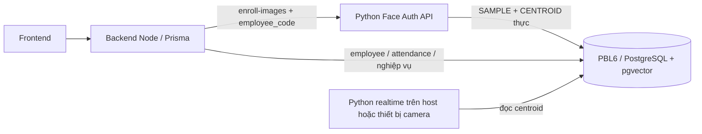

# Đề xuất hợp nhất database và Docker PBL6 / face_auth

Ngày kiểm tra: 2026-10-01. Baseline face_auth: `55c2017 quick fix edge face invalid`.
Code hiện tại: HEAD `550aace`, cộng bản vá local lọc vector NULL và xử lý score lỗi.
Đây là snapshot audit trước patch và phương án triển khai; source changes đã được
triển khai cục bộ. Chưa áp migration lên DB thật.

### Trạng thái triển khai

- Python runtime config trỏ tới DB `PBL6`; model version mặc định theo model pack.
- `VectorDB` xác thực schema khi khởi động, chỉ tìm centroid, lọc vector rỗng
  và kiểm tra kích thước/norm embedding khi ghi.
- Enrollment còn luồng ảnh frontend -> backend -> Python. Fallback vector giả,
  raw embedding endpoint, toggle `face_enrolled` ghi vector và embedding giả
  trong seed đã được gỡ.
- Prisma migration chuyển embedding sang `vector(512)`, xóa riêng embeddings
  cũ, thêm SAMPLE/CENTROID và đảm bảo một centroid active cho mỗi model/người.
- Compose hợp nhất nằm ở root; profile `app` có backend/frontend/Face API/MQTT.
- Migration, seed, enroll 3 ảnh thật, search và cleanup đã qua kiểm tra trên DB
  tạm riêng. Full Docker đã build/start và đường Nginx -> backend -> Face API
  đã được kiểm tra. Chưa triển khai migration lên volume nghiệp vụ hiện có.

Yêu cầu đã chốt: tạo mới toàn bộ dữ liệu khuôn mặt. Giữ dữ liệu nghiệp vụ PBL6;
không cần chuyển embeddings hoặc danh tính từ `face_db` cũ.

## 1. Những gì đã xác minh từ source và cấu hình

| Thành phần | face_auth tại 55c2017 | PBL6 trước patch (snapshot audit) |
|---|---|---|
| Database | `face_db` | backend dùng `PBL6`; face_auth trước patch vẫn dùng `face_db` |
| Nhân viên | `employees.employee_id TEXT` là khóa chính | `employees.id UUID` là khóa chính; `employee_code` là mã nghiệp vụ |
| Khóa ngoại embedding | `employee_id TEXT` trỏ tới mã nhân viên | `employee_id UUID` trỏ tới `employees.id` |
| Vector | `vector(512) NOT NULL` | Prisma trước patch: `vector(512)` nullable; dump PBL6.sql: `real[]` nullable |
| Loại embedding dùng để search | Chỉ `CENTROID` | Query Python trước patch tìm cả `CENTROID` và `SAMPLE` |
| Phiên bản model | Mặc định `buffalo_s` | Python `.env`: `buffalo_s`; một số default backend trước patch là `arcface_v1` |
| Attendance | Python trực tiếp ghi schema riêng | Python đã bỏ ghi attendance; backend quản lý schema nghiệp vụ |
| Docker | `face_auth_db`, host port 5432 | `PBL6_db`, cũng host port 5432 |

Nguồn: [schema cũ còn trong repo](../../database/schema.sql),
[VectorDB hiện tại](../../database/vector_db.py),
[Prisma schema](../../../backend/prisma/schema.prisma),
[initial migration](../../../backend/prisma/migrations/20260924164121_init/migration.sql),
[dump SQL](../../../backend/database/PBL6.sql), hai Compose hiện tại và hai `.env` local.
Schema cũ được đối chiếu trực tiếp bằng `git show 55c2017:face_auth/database/schema.sql`.

### Lỗi cấu hình và dữ liệu có bằng chứng

1. Python đã đổi truy vấn sang schema UUID của PBL6 nhưng `.env` và Compose riêng
   vẫn hướng tới `face_db`. DB legacy thiếu `employees.id`, `employee_code`,
   `face_embeddings.is_active`: query mới sẽ lỗi nếu chạy trên schema legacy đó.
2. Hai PostgreSQL Compose cùng publish `5432:5432`. Không thể chạy đồng thời trên
   cùng địa chỉ host. `localhost:5432` không chứng minh đang kết nối đúng instance.
3. Dump PBL6.sql dùng `embedding real[]`, thiếu `embedding_type`, được dump từ
   PostgreSQL 18.6; Compose hiện chạy PG16. Prisma migration yêu cầu `vector(512)`
   và có migration bổ sung `embedding_type`. Dump này không phải schema chuẩn cho
   việc dựng DB nhận diện. Mount hiện tại tại `/PBL6.sql` không tự import file.
4. `backend/src/modules/employees/employee.service.ts` tạo vector NGẪU NHIÊN khi
   `face_enrolled=true`. Seed cũng tạo vector ngẫu nhiên với nhãn `arcface_v1`.
   Những vector đó không chứng minh nhân viên đã đăng ký khuôn mặt thực.
5. Backend có đường đăng ký raw embedding với default `arcface_v1`, còn enrollment
   từ ảnh qua Python dùng version cấu hình `buffalo_s`. Hai nhãn không tự động
   tương đương, dù cùng có 512 phần tử. DTO raw hiện cho phép 64–1024 phần tử,
   không khớp cột `vector(512)`.
6. Chuyển search từ chỉ centroid sang SAMPLE + CENTROID làm thay đổi gallery và
   hành vi matching so với baseline; không chỉ là đổi schema DB.
7. `seed.ts` hiện xóa cả embeddings, employees, attendance và dữ liệu nghiệp vụ.
   Không chạy seed toàn bộ để sửa riêng việc nhận diện.
8. `DB_CONN_INFO` được README mô tả như env, nhưng config chỉ đọc `DATABASE_URL`
   hoặc `POSTGRES_*`. URL Prisma `?schema=public` không nên đưa nguyên sang psycopg;
   Python cần URL PostgreSQL tương ứng không có tham số Prisma riêng đó.
9. `frontend/src/api/biometricApi.ts::enrollFaceImagesApi` bắt mọi lỗi enrollment,
   fallback đăng ký vector random qua raw endpoint rồi trả `status=ok`, extraction
   rate 100%. Vì vậy UI có thể báo đăng ký thành công dù Python đã thất bại.
   `sample_tag=CENTROID` trong fallback không đặt `embedding_type=CENTROID`;
   backend raw endpoint bỏ qua embedding_type, để DB mặc định SAMPLE.

### Triệu chứng realtime nói được điều gì?

Trong `app.py`, query trả `[]` vẫn cập nhật kết quả `UNKNOWN`. Ngược lại, exception
trong alignment, embedding hoặc DB dẫn tới `invalidate_recognition(retry_delay=True)`;
track chưa có kết quả sẽ tiếp tục hiện `Nhan dien...`. Vì vậy schema/type/connection
error phù hợp với triệu chứng, nhưng chưa xác nhận được error runtime cụ thể.

Kết nối DB read-only từ sandbox bị chặn tại localhost:5432, nên các kết luận trên
là bằng chứng từ source/config/dump, chưa phải inventory DB đang chạy.

Đính chính nhận định trước: PostgreSQL `ORDER BY ... ASC` mặc định `NULLS LAST`,
không phải NULL lên đầu. Bản vá lọc vector NULL là phòng lỗi dữ liệu rỗng; NULL chỉ
có thể làm best score rỗng khi không có vector hợp lệ trong các dòng đủ điều kiện.
Không coi bản vá đó là lời giải cho tất cả lỗi schema/connection.

## 2. Kiến trúc chọn để sửa

- Một PostgreSQL PG16 + pgvector, một DB `PBL6`, dùng schema `public` hiện tại.
- Prisma migrations là nguồn quản lý DDL duy nhất. Python không tạo/xóa bảng.
- Backend quản lý nhân viên, UUID, trạng thái, phân quyền và attendance.
- Python tạo embedding thực, chuẩn hóa, lọc outlier, tính centroid và lưu cùng DB.
- UI dùng `employee_code`; DB FK dùng `employees.id`. Enrollment resolve code sang
  UUID như API hiện tại. Mã lookup hiển thị không thay thế UUID trong quan hệ.
- Realtime camera tiếp tục chạy trên host/Pi. Bản Compose gộp DB + pgAdmin trước;
  không đưa cửa sổ OpenCV/camera macOS vào container trong bước sửa DB này.

Không khôi phục `VectorDB.init_schema()` cũ: hàm đó có nhánh DROP TABLE khi phát hiện
schema `users`/`user_id`; PBL6 có bảng `users` hợp lệ, nên dùng lại hàm cũ có nguy cơ
xóa bảng nghiệp vụ hoặc lỗi FK.

## 3. Các sửa code cần thực hiện

### Kết nối và kiểm tra startup

- Cả backend, Python API và realtime cùng trỏ đúng `PBL6`.
- Host backend: `postgresql://postgres:<password>@localhost:5432/PBL6?schema=public`.
- Host Python: `postgresql://postgres:<password>@localhost:5432/PBL6`.
- Nếu container hóa app sau này: DB hostname `postgres`; backend gọi API hostname
  `face-auth`, không dùng localhost giữa các container.
- Đồng bộ config defaults, `.env.example`, README và launcher. README Python dùng
  đúng `DATABASE_URL`; bỏ đường hướng dẫn khởi chạy PostgreSQL face_auth riêng.
- Python kiểm tra DB readiness, các cột UUID, `vector(512)`, `embedding_type` và
  model version trước khi mở camera. DB sai schema thì lỗi rõ ở startup.
- `/health` cần phân biệt process sống với DB/model ready; log recognition gồm
  track_id, stage, exception type. UI cần trạng thái lỗi khi retry thất bại,
  thay vì chỉ dùng nhãn pending.

### Contract model và gallery

- Với model đang dùng, thống nhất `MODEL_PACK_NAME=buffalo_s` và
  `EMBEDDING_MODEL_VERSION=buffalo_s` cho enrollment và realtime.
- Gỡ default `arcface_v1` trong các hàm hoặc lấy version từ cấu hình đã xác minh.
  DB không tự gán một model version khi writer không cung cấp.
- Giữ đúng model, alignment, normalization và MATCH_THRESHOLD hiện có. Một nhãn
  mới không được dùng để đổi tên vector sinh từ model khác.
- Restore search chỉ `CENTROID`, cộng `is_active=true`, employee ACTIVE,
  đúng model_version và vector không NULL. SAMPLE phục vụ lưu trữ/rebuild centroid.
- Mỗi employee/model có tối đa một centroid active (unique partial index).
- Upsert giữ transaction thay SAMPLE + CENTROID; kiểm tra vector đúng 512 phần tử,
  finite, norm khác zero; validate và L2 normalize trước khi lưu.

### Backend và seed

- Frontend phải bỏ fallback vector random trong enrollFaceImagesApi và bỏ sinh
  vector tự động khi registerFaceEmbeddingApi không nhận embedding hợp lệ.
  Enrollment lỗi phải hiển thị lỗi gốc; chỉ báo thành công theo kết quả Python.
- Sau enrollment, frontend tải lại trạng thái gallery từ backend và cập nhật avatar
  với kết quả được kiểm tra; không dùng PUT face_enrolled=true để tạo dữ liệu face.
- Các số quality/match mô phỏng trong UI không được trình bày như số đo AI thực.
- Bỏ tạo vector ngẫu nhiên từ cờ `face_enrolled`.
- `face_enrolled` là thuộc tính suy ra từ centroid thực, active, đúng model của
  runtime; client gửi true không được tạo dữ liệu sinh trắc học.
- Đường đăng ký chính là enroll-images -> Python. Raw embedding endpoint cần bỏ
  khỏi UI thường hoặc giới hạn writer có contract model rõ, validate đúng 512.
- Seed nghiệp vụ không tạo embedding giả. Seed destructive phải là thao tác reset
  riêng có điều kiện rõ, không nằm trong luồng start/migrate mặc định.
- Cập nhật tests query đang còn giả định centroid-only và các kiểm tra readiness /
  quyền ghi theo hành vi cuối cùng. Không dùng dataset Test để tune threshold.

## 4. Tạo mới dữ liệu face, giữ nghiệp vụ PBL6

1. Kiểm tra container/volume thực tế và dump backup PBL6 trước thay DDL.
2. Dừng writer embeddings và realtime trong thời gian reset.
3. Chỉ xóa các dòng `PBL6.public.face_embeddings`; không xóa employees, users,
   attendance, payroll. `face_db` cũ không được nhập vào PBL6.
4. Prisma repair migration đã được tạo; nó:
   - `CREATE EXTENSION IF NOT EXISTS vector`;
   - nếu embedding còn `real[]`, đổi sang `vector(512)` sau khi bảng face rỗng;
   - thêm `embedding_type` nếu thiếu; đặt embedding NOT NULL;
   - bỏ default model_version, giữ model_version NOT NULL;
   - đảm bảo FK employee_id UUID -> employees.id;
   - check embedding_type SAMPLE/CENTROID; unique centroid active employee/model;
   - rebuild HNSW cosine index sau khi sửa column type.
5. Nếu DB có schema sẵn nhưng migration history chưa có, baseline theo schema thực
   tế rồi áp dụng repair migration. Không chạy initial migration tạo lại các bảng
   đã tồn tại, không `migrate reset`, không `db push --accept-data-loss` toàn DB.
6. Schema mới hoàn toàn thì chạy migration history từ đầu; không import PBL6.sql
   làm nền cho DB vector và không chạy seed destructive trên DB nghiệp vụ đang dùng.
7. Đăng ký ảnh mới cho các employee PBL6 bằng API. Xác minh một centroid/model/người.
8. Chạy recognition sau enrollment: DB trống -> UNKNOWN; ảnh người đã đăng ký ->
   matching; người khác -> UNKNOWN; DB hỏng -> thông báo lỗi rõ.

Migration chỉ dành cho bảng `PBL6.public.face_embeddings`; nó không chuyển đổi
schema legacy `face_db`. Chưa chạy vì chưa xác minh volume/DB thật. Nếu database có
schema tồn tại nhưng thiếu migration history, phải baseline theo schema thực tế
trước khi dùng `prisma migrate deploy`; không reset hoặc `db push` toàn database.

## 5. Gộp Docker

Bản hợp nhất: [docker-compose.yml](../../../docker-compose.yml), cấu hình mẫu
[.env.compose.example](../../../.env.compose.example).

Bản compose có một postgres, healthcheck và pgAdmin optional profile `tools`. Nó yêu cầu
volume PBL6 hiện có qua `PBL6_POSTGRES_VOLUME`, để đổi vị trí Compose không vô tình
tạo volume rỗng rồi tưởng dữ liệu mất. Tên volume phải lấy từ Docker inspect, không
đoán là `backend_postgres_data`. POSTGRES_* chỉ init cluster mới; đặt DB=PBL6 không
tự đổi DB tồn tại trong một volume face_db.

Khi triển khai:

1. Xác nhận mount data của `PBL6_db` và phiên bản server bằng inspect/read-only SQL.
2. Đặt PBL6_POSTGRES_VOLUME và password đúng cluster hiện tại trong env triển khai.
3. Dừng hai Compose cũ (giữ volumes). Không có hai postgres cùng mở một PGDATA.
4. Chạy root Compose dùng volume PBL6 đó. Chỉ một server publish 5432.
5. Backend và Python host cùng kết nối localhost/PBL6 như trên; pgAdmin container
   kết nối service `postgres` port 5432.
6. `run.sh`, `run.bat`, README đã chuyển sang root Compose. Hai Compose con đã được
   gỡ để không giữ entrypoint DB có cấu hình mâu thuẫn.
7. Nếu cần rollback hạ tầng, dừng root postgres trước khi bật lại Compose backend
   dùng cùng volume. Rollback schema cần backup riêng; đổi Compose không undo DDL.

Dockerfiles backend/frontend/Face API, dependency uvicorn, model cache và profile
`app` đã được bổ sung. Hướng dẫn migration/seed, chạy full và cleanup ở
[run_full_stack.md](../../../docs/run_full_stack.md). Cửa sổ camera/PAD vẫn chạy
trên host/Pi; kiểm tra stack API không thay thế kiểm tra camera thật.

## 6. Điều kiện nghiệm thu

- Chỉ một postgres đang chạy; cả backend và Python báo đúng DB `PBL6`.
- DB thực tế có `vector(512)`, UUID FK, embedding_type và extension vector.
- Backend và Python cùng model contract, không còn vector random được coi là enrolled.
- Test offline có ý nghĩa: empty gallery, centroid-only filtering, atomic replace,
  schema/type lỗi, DB outage, model mismatch, invalid vector dimension/norm.
- Integration trên DB dùng thử: tạo employee -> enroll ảnh -> có samples/centroid
  -> search -> deactivate/remove -> không còn match; không phát sinh attendance
  từ Python chỉ vì recognition chạy.
- Camera thực: ghi log stage/track_id/DB error và kết quả cho người đã đăng ký,
  người khác và PAD spoof. Chưa có kết quả camera đo được trong audit này.

## Nguồn chính thức được kiểm tra

- [PostgreSQL ORDER BY](https://www.postgresql.org/docs/current/queries-order.html):
  ASC mặc định NULLS LAST.
- [Docker Compose networking](https://docs.docker.com/compose/how-tos/networking/):
  giữa containers dùng service name và container port; host dùng published port.
